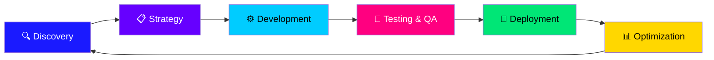

<!--
  ██████╗ ██╗ ██████╗ ██╗████████╗███████╗ ██████╗██╗  ██╗
  ██╔══██╗██║██╔════╝ ██║╚══██╔══╝██╔════╝██╔════╝██║  ██║
  ██║  ██║██║██║  ███╗██║   ██║   █████╗  ██║     ███████║
  ██║  ██║██║██║   ██║██║   ██║   ██╔══╝  ██║     ██╔══██║
  ██████╔╝██║╚██████╔╝██║   ██║   ███████╗╚██████╗██║  ██║
  ╚═════╝ ╚═╝ ╚═════╝ ╚═╝   ╚═╝   ╚══════╝ ╚═════╝╚═╝  ╚═╝
-->

<div align="center">

<!-- Animated Banner -->


<!-- Typing Animation -->
<a href="https://github.com/DigiTech-Solutions">
  
</a>

<br/>

<!-- Animated Badges Row -->
<p>
  
  
  
  
</p>
<p>
  
  
  
  
</p>

<!-- Divider -->


</div>

---

##  &nbsp; About DigiTech Solutions


```python
class DigiTechSolutions:
    def __init__(self):
        self.name       = "DigiTech Solutions"
        self.founder    = "Mehwish Fatima (CEO & Founder)"
        self.focus      = ["AI", "Machine Learning", "Deep Learning",
                           "NLP", "Computer Vision", "Web Dev", "SaaS"]
        self.mission    = "Empower businesses through AI & innovation"
        self.location   = "Pakistan 🇵🇰"
        self.email      = "mehwishfatima95332@gmail.com"
        self.website    = "digitechsolutions.pk"
        self.status     = "🚀 Building the Future"

    def what_we_do(self):
        return [
            "🤖 AI-Powered Business Solutions",
            "📊 Data Analytics & Insights",
            "💻 Web & SaaS Development",
            "🎯 Digital Marketing & SEO",
            "🎨 Graphic Design & Branding",
            "🔧 IT Consulting & Automation",
        ]
```

<br clear="right"/>

---

<div align="center">

##  &nbsp; Our AI Services Universe

</div>

<!-- Services Grid with Badges -->
<table align="center">
<tr>
<td align="center" width="200">

### 🤖 AI Solutions


**AI Chatbots, Recommendation Engines, Predictive Analytics, Process Automation**

</td>
<td align="center" width="200">

### 📊 Data & Analytics


**Data-driven strategies, Business Intelligence, Smart Dashboards, Insights**

</td>
<td align="center" width="200">

### 💻 Web & SaaS Dev


**Business Websites, eCommerce, SaaS Platforms, Custom Web Applications**

</td>
</tr>
<tr>
<td align="center" width="200">

### 🎯 Digital Marketing


**SEO, Social Media Marketing, PPC Advertising, Brand Growth Strategies**

</td>
<td align="center" width="200">

### 🎨 Creative Design


**Logo Design, Brand Identity, Marketing Assets, UI/UX Design**

</td>
<td align="center" width="200">

### 🔧 IT Consulting


**Process Automation, IT Infrastructure, Smart Systems, AI-Based Solutions**

</td>
</tr>
</table>

---

<div align="center">

## 🌟 Industry Solutions We Serve


</div>

```
┌──────────────────────────────────────────────────────────────────────────────┐
│                        🏭  INDUSTRY SOLUTIONS                                │
├───────────────┬────────────────────┬────────────────────┬────────────────────┤
│  🛒 E-Commerce │  🏥 Healthcare      │  🏦 Finance & Bank  │  🏗️ Manufacturing  │
│  Smart Recs   │  Predictive Diag   │  Fraud Detection   │  Predictive Maint  │
│  Dynamic Pricing│  Patient Monitor  │  Risk Analytics    │  Quality Control   │
│  ROI: 320%    │  ROI: 280%         │  ROI: 450%         │  ROI: 380%         │
├───────────────┼────────────────────┼────────────────────┼────────────────────┤
│  🏪 Retail     │  🎓 Education      │  🚚 Logistics       │  💡 Custom AI      │
│  Customer AI   │  Adaptive Learning │  Route Optimizer   │  Any Industry      │
│  Demand Fore   │  Performance Pred  │  Fleet Mgmt        │  Tailored AI       │
│  ROI: 340%    │  ROI: 300%         │  ROI: 360%         │  ROI: 400%+        │
└───────────────┴────────────────────┴────────────────────┴────────────────────┘
```

---

<div align="center">

## ⚡ Technology Stack

</div>

### 🤖 AI & Machine Learning
<p align="center">
  
  
  
  
  
  
  
  
</p>

### 💻 Web & SaaS Development
<p align="center">
  
  
  
  
  
  
  
  
</p>

### 📊 Data & Analytics
<p align="center">
  
  
  
  
  
  
</p>

---

<div align="center">

## 📈 How We Work — Our Process

</div>



<br/>

<table align="center">
<tr>
  <td align="center">
    <br/>
    <b>🔍 Assessment</b><br/>
    <sub>Analyze your business & identify AI opportunities</sub>
  </td>
  <td align="center">➡️</td>
  <td align="center">
    <br/>
    <b>📋 Strategy</b><br/>
    <sub>Design a comprehensive AI roadmap</sub>
  </td>
  <td align="center">➡️</td>
  <td align="center">
    <br/>
    <b>⚙️ Implementation</b><br/>
    <sub>Deploy with minimal disruption</sub>
  </td>
  <td align="center">➡️</td>
  <td align="center">
    <br/>
    <b>📊 Optimization</b><br/>
    <sub>Monitor, improve & maximize ROI</sub>
  </td>
</tr>
</table>

---

<div align="center">

## 🏆 Why Choose DigiTech Solutions?

<table>
<tr>
<td align="center">

🚀 **Faster Results**
See measurable improvements in weeks, not months

</td>
<td align="center">

🛡️ **Secure & Compliant**
Industry-leading security & regulatory compliance

</td>
<td align="center">

👥 **Expert Team**
Industry veterans who understand your business

</td>
</tr>
<tr>
<td align="center">

🔄 **24/7 Support**
Round-the-clock support & continuous optimization

</td>
<td align="center">

📈 **Proven ROI**
Average ROI of 350%+ with transparent reporting

</td>
<td align="center">

⚙️ **Customizable**
Flexible solutions adapting to your unique needs

</td>
</tr>
</table>

</div>

---

<div align="center">

## 🌍 Before & After — The DigiTech Difference

</div>

<table align="center">
<tr>
<th>❌ Before DigiTech Solutions</th>
<th>✅ After DigiTech Solutions</th>
</tr>
<tr>
<td>

- Manual, error-prone processes
- High operational costs
- Slow response to market changes
- Limited customer insights
- Competitive disadvantage
- Difficulty scaling operations

</td>
<td>

- ✨ Automated intelligent processes
- 💰 30–50% cost reduction
- ⚡ Real-time market adaptation
- 🔬 Deep AI-powered customer insights
- 🏆 Market leadership position
- 📈 Seamless, infinite scalability

</td>
</tr>
</table>

---

<div align="center">

## 📊 Our Impact in Numbers

<br/>


&nbsp;

&nbsp;

&nbsp;


</div>

---

<div align="center">

## 👩‍💻 Meet Our Founder & CEO


<br/>

> *"At DigiTech Solutions, we don't just deliver services — we build partnerships. We believe in the power of technology to transform businesses and lives, and our vision is to be at the forefront of this digital revolution."*
>
> — **Mehwish Fatima**, CEO & Founder

<br/>

[](mailto:mehwishfatima95332@gmail.com)
[](https://digitechsolutions.pk)
[](https://linkedin.com)
[](https://github.com/DigiTech-Solutions)

</div>

---

<div align="center">

## 🚀 Let's Build Something Extraordinary Together!


<br/>

[](mailto:mehwishfatima95332@gmail.com)
&nbsp;
[](https://digitechsolutions.pk)
&nbsp;
[](https://digitechsolutions.pk)

<br/>

---


<sub>© 2025 DigiTech Solutions — All Rights Reserved | Pakistan 🇵🇰</sub>

</div>